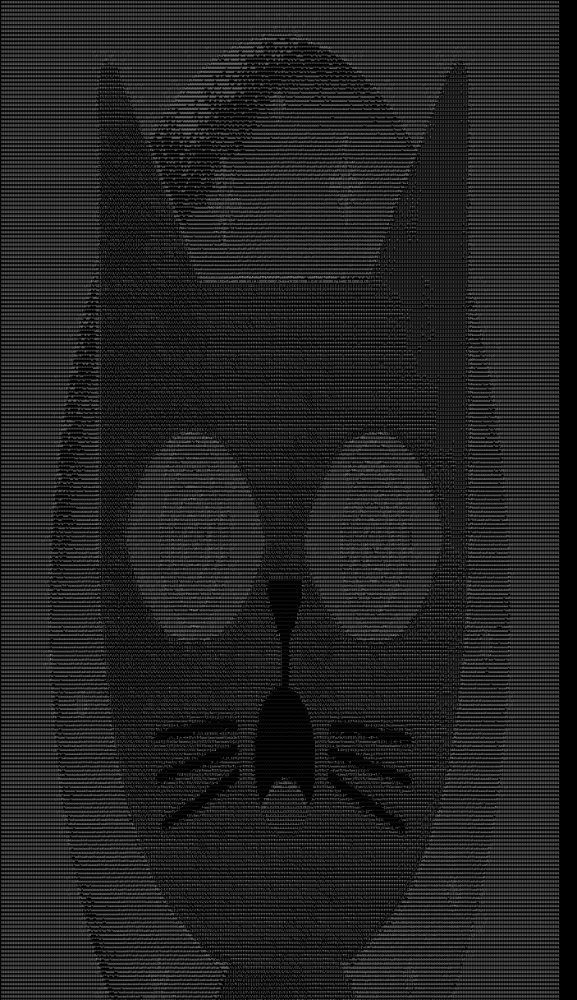

# asciiArt

## how to run:

```console
@user$ go run main.go
```

- to change the image just copy it and change the name in the function `getImage`:
    - `getImage('image.jpeg')`

- to get better view of the image zoom - using Ctrl-

## options

- it has 4 options, being:
    - `--up` this will inverte the image
    - `--reverseColor` this will reverse the color of the image, chosing the rigth brightness
    - `--color` + `blue` this will print the image in the color chosen by you, being `blue`, `red`,`green`,`purple` and `brown`.

# to optimise :

- better performance
- use it not just in .jpeg, but in others
- resize using the arg

